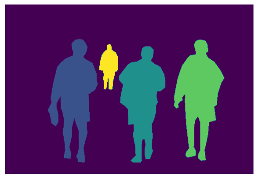
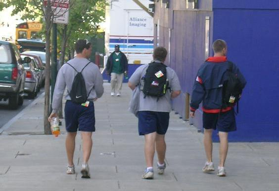
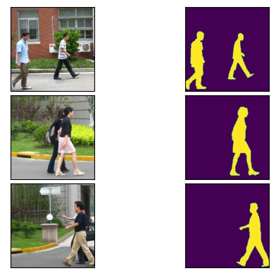

#  PyTorch DeepLab

The model is from the [ torchvision module ]( sttps://pytorch.org/vision/stable/models.html#semantic-segmentation )

## Dataset
### [ PennFudan dataset ](https://www.cis.upenn.edu/~jshi/ped_html/)

The heights of labeled pedestrians in this database fall into [180,390] pixels. All labeled pedestrians are straight up.

There are 170 images with 345 labeled pedestrians, among which 96 images are taken from around University of Pennsylvania, and other 74 are taken from around Fudan University.

```
PennFudanPed/
  PedMasks/
    FudanPed00001_mask.png
    FudanPed00002_mask.png
    FudanPed00003_mask.png
    FudanPed00004_mask.png
    ...
  PNGImages/
    FudanPed00001.png
    FudanPed00002.png
    FudanPed00003.png
    FudanPed00004.png
```
### **segmentation masks**



### **transforms**

## Installing dependencies
### Using pip
```
pip install -r requirements.txt
```